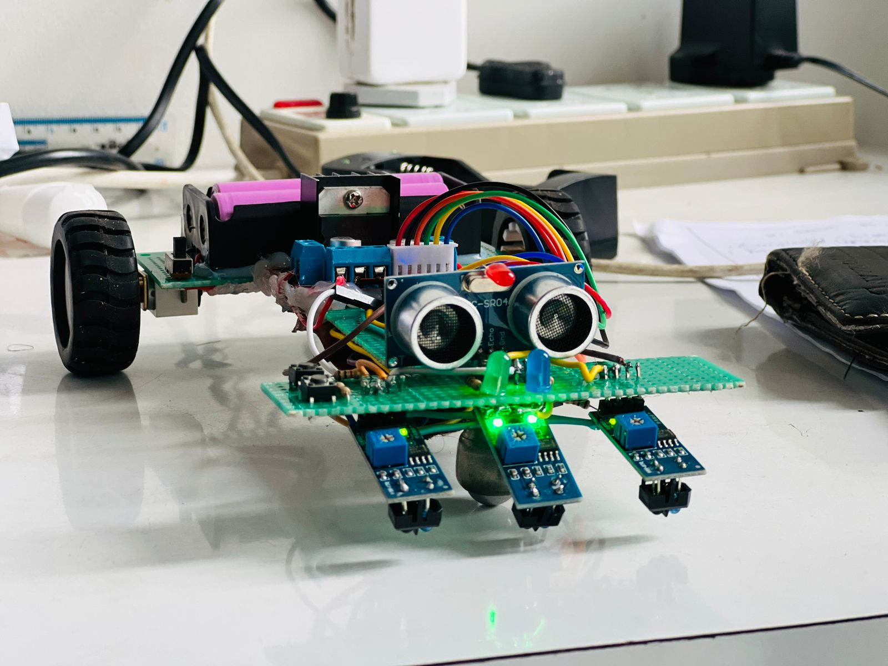
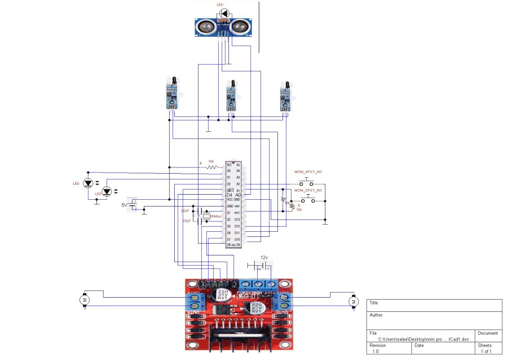

# Line_Following_Robot_with_ATmega328p
Rahul’s Blog – Sharing thoughts and projects
# 🤖 Line Following Robot with Obstacle Detection

🚗 A DIY **ATmega328P + L298N** powered **Line Following Robot** with ultrasonic obstacle detection.  
⚡ Runs on dual 18650 Li-ion batteries.  
🎯 Uses IR sensors for line tracking, ultrasonic sensor for collision avoidance, and LEDs for mode indication.  

---

## 📸 Project Preview
 

---

## 🛠️ Hardware Components
- ATmega328P Microcontroller  
- L298N Motor Driver Module  
- HC-SR04 Ultrasonic Sensor  
- IR Sensors (×3, digital)  
- Push Buttons (×2)  
- LEDs (Green, Blue, Red)  
- 2 × 18650 Li-ion Batteries + Holder  
- Gear Motors + Wheels  
- Custom PCB / Perfboard  

---

## ⚡ Features
- 🛣️ Follows a black line on a white surface  
- 🚧 Detects and avoids obstacles  
- 🔄 Mode switching with push buttons  
- 💡 LED indicators for status feedback  
- 🔋 Battery powered  

---

## 📍 Pin Mapping

| Component       | ATmega328P Pin | Arduino Pin |
|-----------------|----------------|-------------|
| ENA             | PD5            | D5          |
| ENB             | PD6            | D6          |
| IN1, IN2        | PD2, PD3       | D2, D3      |
| IN3, IN4        | PD4, PD7       | D4, D7      |
| Ultrasonic TRIG | PB1            | D9          |
| Ultrasonic ECHO | PB0            | D8          |
| IR Sensors      | PB2, PB3, PB4  | D10, D11, D12 |
| Buttons         | PC1, PC2       | A1, A2      |
| LEDs            | PD0, PD1, PC0  | D0, D1, A0  |

---

## 🔌 Circuit Diagram

---

## 📂 Repository Structure
